# Windows Server AD and Microsoft Entra ID Hybrid Identity Synchronization Project

## Project Overview

This project demonstrates a hybrid identity setup connecting Windows Server Active Directory with Microsoft Entra ID. The project focused on Active Directory users, computers, DNS, organizational units, AD groups, Group Policy Objects, DHCP scope, Entra Connect Sync readiness, and validation of synchronized users in Microsoft Entra ID and Microsoft 365 Admin Center.

This public GitHub version has been sanitized. Company names, domain names, usernames, email addresses, computer names, IP addresses, DNS records, tenant identifiers, dates, system names, and infrastructure identifiers have been redacted.

## Architecture

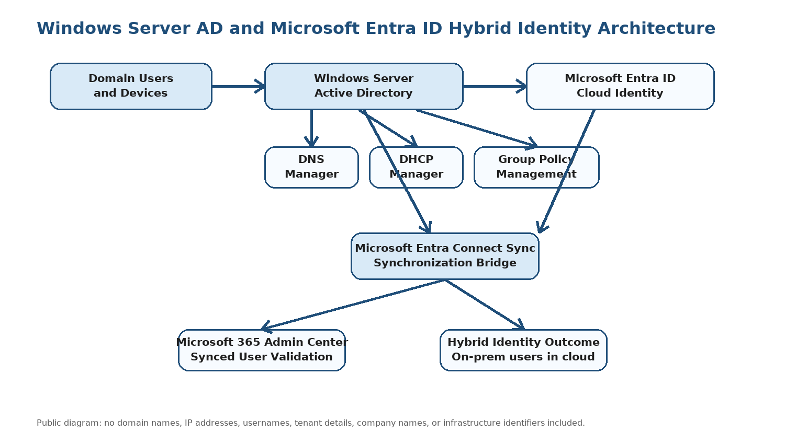

## Project Summary

| Area | Details |
|---|---|
| Project Type | Windows Server AD and Microsoft Entra ID hybrid identity synchronization |
| Project | Identity and infrastructure project |
| Client Type | Organization with on-premises identity and Microsoft 365 cloud services |
| Environment | Windows Server Active Directory and Microsoft Entra ID |
| Primary Role | Microsoft Identity and Access Engineer / Microsoft Cloud Security Engineer |
| Project Focus | Hybrid identity setup, AD Connect / Entra Connect sync, DNS, DHCP, GPO, Entra ID, and M365 user validation |
| Public Version Note | Sensitive infrastructure, tenant, domain, user, IP, and organization details are redacted |

## Business Requirement

The organization required a hybrid identity environment to connect on-premises Windows Active Directory identities with Microsoft cloud identity services. The environment needed centralized identity management, domain-joined systems, DNS and DHCP support, group policy governance, and user synchronization into Microsoft Entra ID and Microsoft 365.

The environment needed to support:

- Windows Active Directory user administration
- Domain resource organization using OUs
- Active Directory group management
- DNS record and zone management
- DHCP scope creation and network address management
- Group Policy Object review and validation
- Synchronization of on-premises users to Microsoft Entra ID
- Cloud validation in Microsoft Entra ID and Microsoft 365 Admin Center
- Entra Connect Sync readiness validation

## Technologies Used

- Windows Server Active Directory
- Active Directory Users and Computers
- DNS Manager
- DHCP Manager
- Group Policy Management Console
- Command Prompt / gpupdate
- Microsoft Entra Connect Sync
- Microsoft Entra ID
- Microsoft 365 Admin Center
- VirtualBox lab environment

## Scope of Work

Completed work included:

- Created and reviewed Windows AD users
- Reviewed computers and domain containers
- Reviewed DNS zone and host records
- Created and reviewed organizational units
- Created and reviewed Active Directory groups
- Reviewed Group Policy Objects
- Validated synced users in Microsoft Entra ID
- Validated synced users in Microsoft 365 Admin Center
- Reviewed DHCP scope configuration
- Tested Group Policy update from command prompt
- Reviewed Entra Connect Sync ready-to-configure screen

## Implementation Evidence

The screenshots below use surgical redaction. The Windows AD, DNS, DHCP, GPO, Entra ID, Microsoft 365 and Entra Connect task context remains visible while sensitive identity, domain, IP, tenant and infrastructure details are blocked.

### 1. Active Directory Users

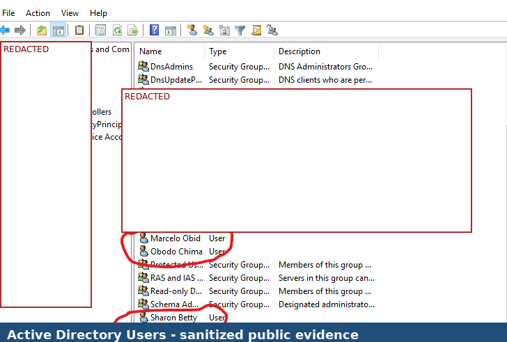

### 2. Active Directory Computers

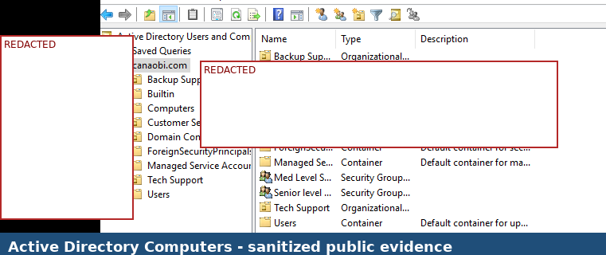

### 3. DNS Manager

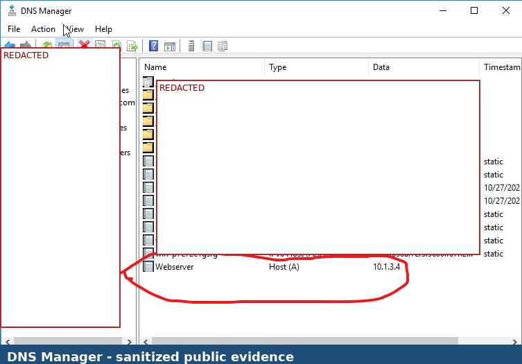

### 4. Active Directory Organizational Units

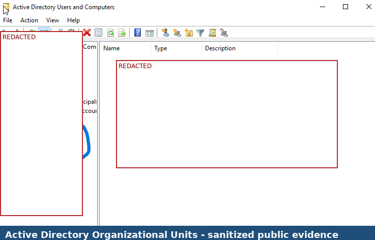

### 5. Active Directory Groups

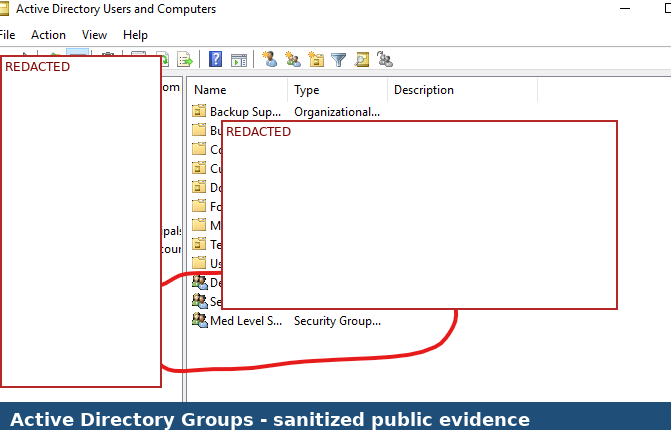

### 6. Group Policy Objects

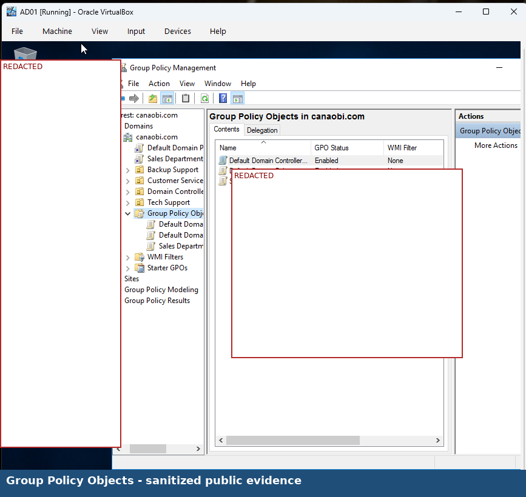

### 7. Entra ID Synchronized Users

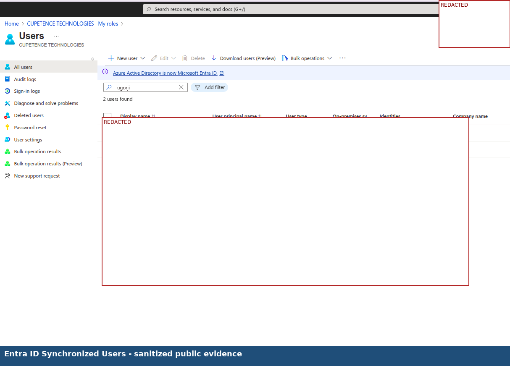

### 8. Microsoft 365 Synced Users

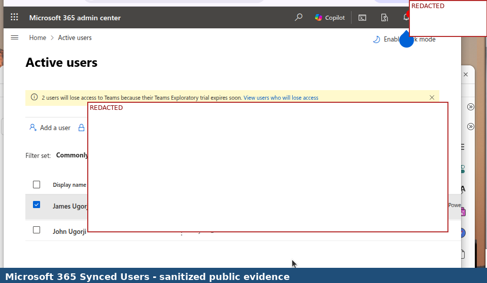

### 9. DHCP Scope

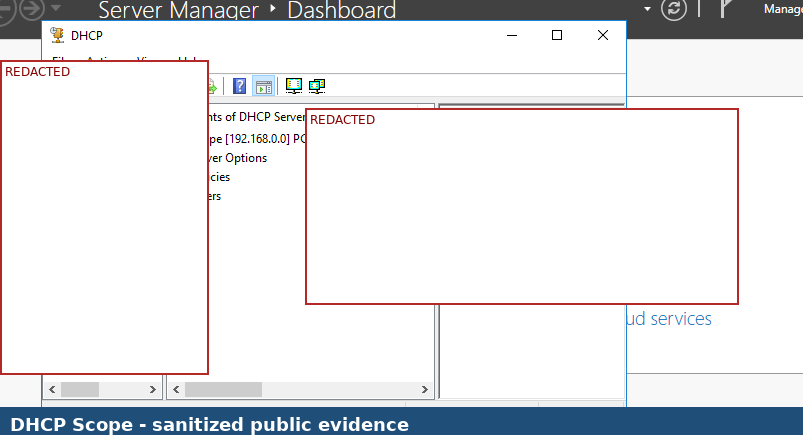

### 10. Group Policy Update Testing

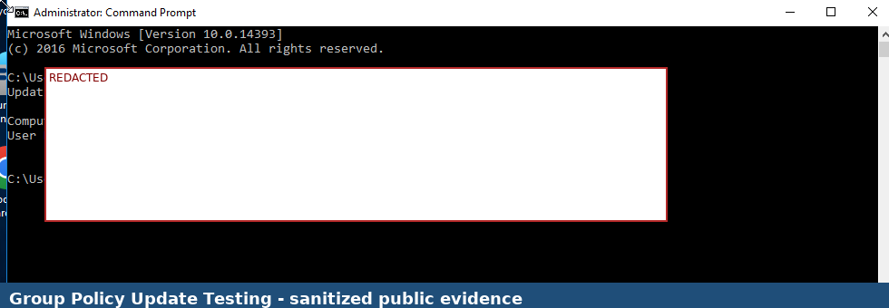

### 11. Entra Connect Sync Readiness

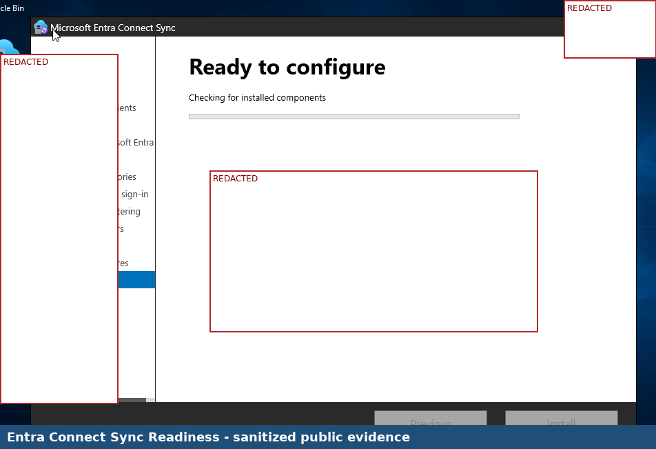

## Validation Results

| Validation Area | Expected Result | Actual Result |
|---|---|---|
| AD user creation | Users can be created and viewed in Active Directory | Successful |
| AD computer/container visibility | Domain containers and computer objects are visible | Successful |
| DNS zone review | DNS zone and related records are visible | Successful |
| OU structure | Organizational Units are visible in ADUC | Successful |
| AD group creation | Security groups are visible in Active Directory | Successful |
| GPO review | Group Policy Objects are visible in GPMC | Successful |
| Entra ID synchronization | On-premises AD users are visible in Entra ID | Successful |
| Microsoft 365 validation | Synced users are visible in Microsoft 365 Admin Center | Successful |
| DHCP scope review | DHCP scope is visible in DHCP Manager | Successful |
| Group policy refresh | Policy update completes successfully | Successful |
| Entra Connect readiness | Ready-to-configure screen is visible | Successful |

## Key Skills Demonstrated

- Windows Server Active Directory administration
- User, computer, group and OU administration
- DNS zone and host record management
- DHCP scope administration
- Group Policy Object review and validation
- Microsoft Entra Connect Sync readiness and hybrid identity validation
- Microsoft Entra ID synchronized user validation
- Microsoft 365 Admin Center cloud user validation
- Hybrid identity architecture documentation
- Public portfolio redaction and confidentiality handling

## Security and Confidentiality Notice

This public portfolio version was redacted before GitHub upload. The purpose is to demonstrate hybrid identity work while protecting confidential infrastructure and tenant information.

The following information has been removed or blocked from the public version:

- Company names
- Domain names and DNS zones
- User display names and usernames
- Email addresses and user principal names
- Computer names and server names
- IP addresses and host records
- OU names or group names if sensitive
- Tenant names and Microsoft 365 / Entra organization labels
- Dates and timestamps
- AD Connect, sync, diagnostic or configuration identifiers

## Lessons Learned

- Hybrid identity requires a working on-premises identity foundation before cloud synchronization can be validated.
- DNS and DHCP are important supporting services for Windows AD environments.
- Organizational Units and groups help keep directory objects organized and manageable.
- Group Policy helps standardize domain configuration and policy enforcement.
- Microsoft Entra Connect Sync bridges on-premises Windows AD identities into Microsoft Entra ID.
- Cloud validation should be performed in both Microsoft Entra ID and Microsoft 365 Admin Center.
- Hybrid identity screenshots must be redacted carefully because they expose infrastructure, users, domains and tenant details.

## Project Outcome

The hybrid identity environment was successfully validated across Windows Server Active Directory, DNS, DHCP, Group Policy, Microsoft Entra Connect Sync readiness, Microsoft Entra ID synchronized users, and Microsoft 365 Admin Center synced user visibility. The project demonstrates practical experience with both on-premises identity infrastructure and cloud identity integration.

## Conclusion

This project demonstrates hybrid identity experience across Windows Server Active Directory, DNS, DHCP, Group Policy, Microsoft Entra ID, Microsoft Entra Connect Sync, and Microsoft 365 cloud user validation. It supports career positioning for Microsoft Identity and Access Engineer, Microsoft Cloud Security Engineer, Microsoft Systems Engineer, Microsoft 365 Cloud Engineer and Azure Cloud Engineer roles.
