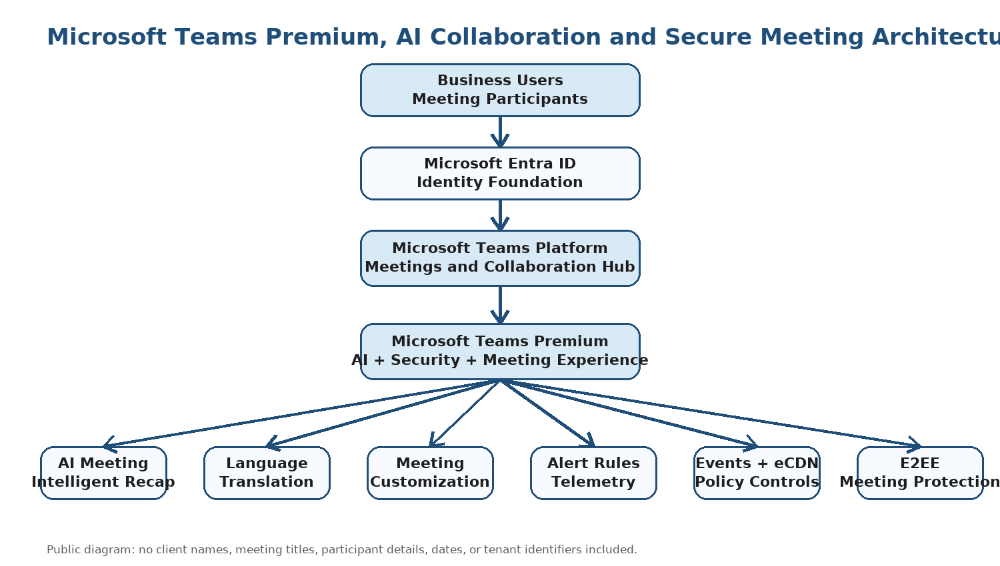
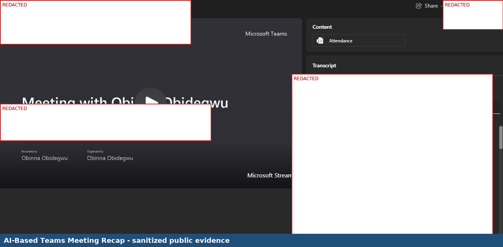
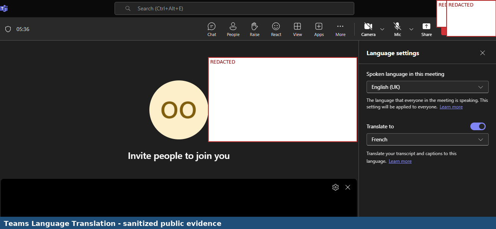
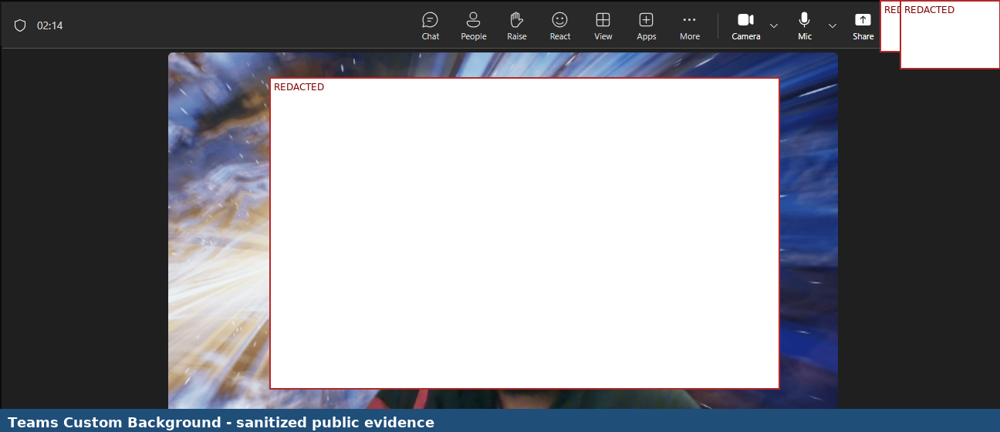
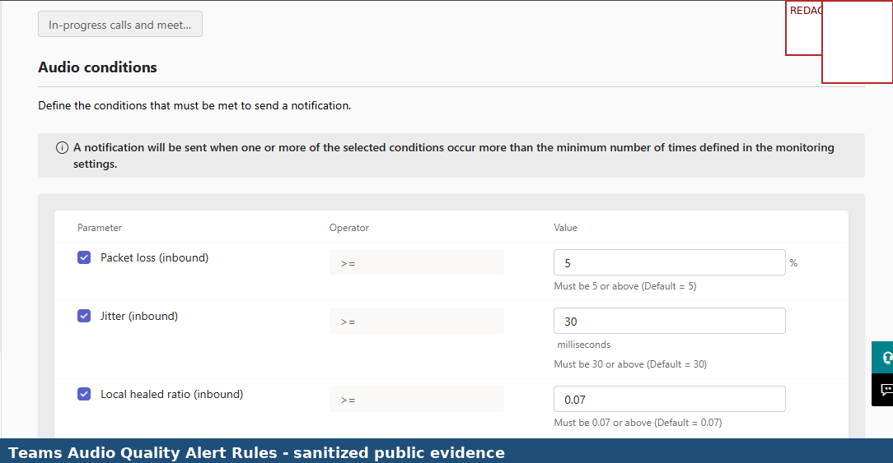
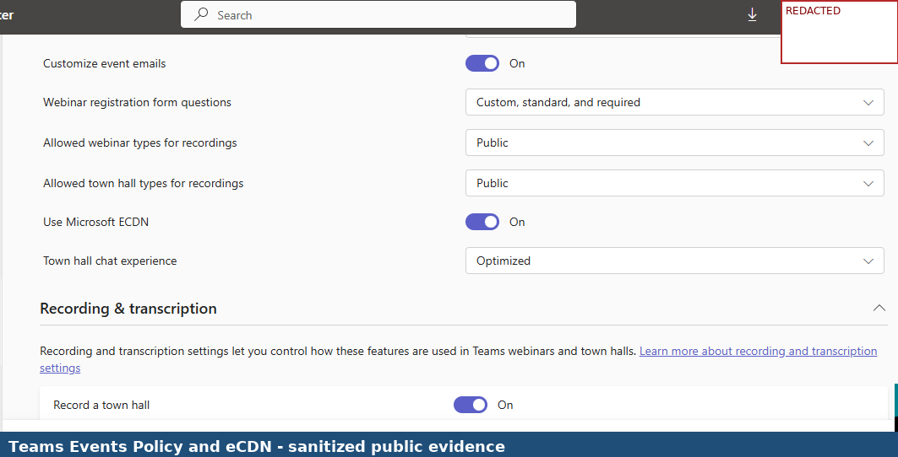
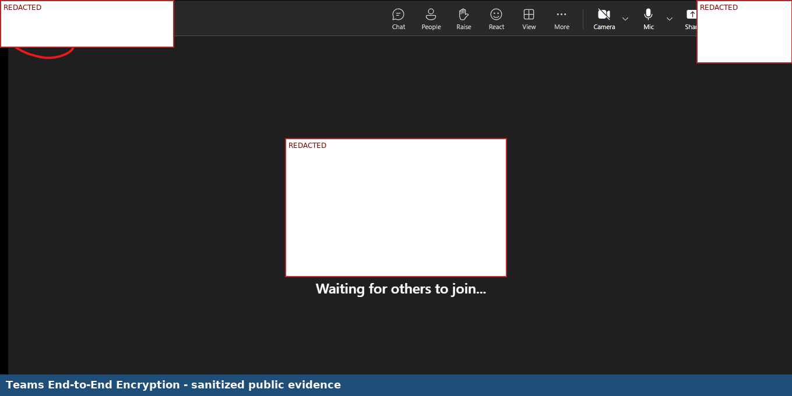

# Microsoft Teams Premium, AI Collaboration and Secure Meeting Experience Project

## Project Overview

This project demonstrates Microsoft Teams Premium capabilities for AI-assisted meetings, language accessibility, meeting customization, quality monitoring, event delivery, eCDN-related configuration, and secure meeting protection. The project focused on Teams Premium Intelligent Recap, Teams translation, custom meeting background, Teams Admin Center alert rules, Teams Events policy configuration, eCDN-related event controls, and end-to-end encryption validation.

This public GitHub version has been sanitized. Company names, meeting participant details, meeting titles, transcript content, user images/faces, tenant identifiers, dates, policy identifiers, and other private meeting information have been redacted.

## Architecture

## Project Summary

| Area | Details |
|---|---|
| Project Type | Microsoft Teams Premium feature implementation and meeting experience validation |
| Project | Microsoft Teams Premium project |
| Client Type | Organization using Microsoft Teams for meetings and communications |
| Environment | Microsoft 365 cloud tenant |
| Primary Role | Microsoft 365 Modern Work Cloud Engineer / Microsoft Teams Engineer |
| Project Focus | Teams Premium, AI recap, translation, meeting customization, alert rules, events policy, eCDN, and E2EE |
| Public Version Note | Sensitive meeting, user, tenant, date, participant, and transcript details are redacted |

## Business Requirement

The organization required an enhanced Microsoft Teams meeting experience to improve meeting productivity, accessibility, security, branding, operational monitoring, and event delivery. Standard Teams meetings were not enough for the organization’s growing collaboration and communications requirements.

The environment needed to support:

- AI-powered meeting recap and follow-up support
- Language translation for multilingual meeting participants
- Custom meeting experiences
- Meeting quality alert rules and monitoring
- Teams Events policy governance
- eCDN-related event delivery controls
- End-to-end encryption for secure meeting communication
- Teams Premium feature validation

## Technologies Used

- Microsoft Teams Premium
- Microsoft Teams
- Microsoft Teams Admin Center
- Teams Intelligent Recap
- Teams Meeting Translation
- Teams Meeting Customization
- Teams Alert Rules / Real-Time Telemetry
- Teams Events
- eCDN-related event controls
- End-to-End Encryption
- Microsoft Entra ID
- Microsoft 365 Licensing

## Scope of Work

Completed work included:

- Validated AI-based Teams meeting recap
- Validated meeting language translation
- Applied a custom Teams meeting background
- Reviewed Teams Admin Center alert rules for meeting audio quality
- Reviewed Teams Events policy controls
- Validated eCDN-related event delivery setting
- Validated end-to-end encryption evidence in a Teams meeting
- Documented screenshots as delivery evidence
- Sanitized screenshots for public portfolio use

## Implementation Evidence

The screenshots below use surgical redaction. Teams Premium product areas and feature context remain visible, while identities, meeting details, transcript content, faces, dates, tenant identifiers, and private meeting information are blocked.

### 1. AI-Based Teams Meeting Recap

### 2. Teams Language Translation

### 3. Teams Custom Background

### 4. Teams Audio Quality Alert Rules

### 5. Teams Events Policy and eCDN

### 6. Teams End-to-End Encryption

## Validation Results

| Validation Area | Expected Result | Actual Result |
|---|---|---|
| AI meeting recap | Teams Premium recap experience is visible and usable | Successful |
| Language translation | Meeting translation experience is available | Successful |
| Meeting customization | Custom meeting background can be applied | Successful |
| Audio quality alert rules | Alert rule configuration is visible in Teams Admin Center | Successful |
| Teams Events / eCDN policy | Teams Events policy and event delivery controls are visible | Successful |
| End-to-end encryption | E2EE meeting protection evidence is visible | Successful |

## Key Skills Demonstrated

- Microsoft Teams Premium feature validation
- Teams Intelligent Recap and AI meeting productivity awareness
- Teams meeting language translation validation
- Teams meeting customization experience
- Teams Admin Center alert rule and telemetry awareness
- Teams Events policy review
- eCDN-related event delivery governance awareness
- Teams meeting protection and E2EE validation
- Microsoft Teams security and collaboration documentation
- Public portfolio redaction and confidentiality handling

## Security and Confidentiality Notice

This public portfolio version was redacted before GitHub upload. The purpose is to demonstrate hands-on Teams Premium capabilities while protecting confidential meeting and tenant information.

The following information has been removed or blocked from the public version:

- Company names
- Meeting participant names, initials, avatars, and profile cards
- Visible faces or personally identifying meeting video content
- Meeting titles, meeting chat content, and transcript details
- Tenant names and domains
- Dates and times shown in meeting or admin screens
- Policy names if they expose internal naming conventions
- Meeting IDs, user identifiers, telemetry identifiers, or diagnostic identifiers
- Private AI recap text that includes names or business context

## Lessons Learned

- Teams Premium can improve meeting productivity through AI-generated recaps.
- Language translation supports more inclusive multilingual collaboration.
- Meeting customization can improve the meeting experience and presentation quality.
- Alert rules and telemetry help administrators monitor meeting quality.
- eCDN and Teams Events policies support scalable event delivery and monitoring.
- End-to-end encryption supports enhanced meeting confidentiality.
- AI recap and transcript-related screenshots must be handled carefully before public sharing.
- Teams Premium features make a Microsoft Teams portfolio more modern and marketable.

## Project Outcome

The Microsoft Teams Premium meeting experience was successfully validated across AI recap, language translation, meeting customization, audio quality alert rules, Teams Events policy/eCDN controls, and end-to-end encryption. The project demonstrates practical exposure to modern Teams Premium features that improve productivity, accessibility, security, meeting quality, and large-scale event delivery.

## Conclusion

This project demonstrates Microsoft Teams Premium experience across advanced Teams meeting features, AI collaboration, translation, event governance, telemetry awareness, and meeting protection. It supports career positioning for Microsoft 365 Cloud Engineer, Microsoft Teams Engineer, Modern Workplace Engineer, and Teams & Voice Engineer roles.
