# Microsoft 365 PowerShell Automation and Platform Expansion Project

## Project Overview

This project demonstrates Microsoft 365 platform expansion using PowerShell automation. The project focused on scripted user creation, CSV-based bulk user provisioning, Microsoft 365 group creation, group membership assignment, Microsoft Teams creation, Teams meeting policy creation, shared mailbox creation, SharePoint Online site creation, and reporting across Teams, mailboxes, Microsoft 365 users, and SharePoint sites.

This public GitHub version has been sanitized. Company names, user names, email addresses, domains, tenant names, tenant URLs, SharePoint URLs, object IDs, group IDs, mailbox details, site details, dates, timestamps, and diagnostic identifiers have been redacted.

## Architecture

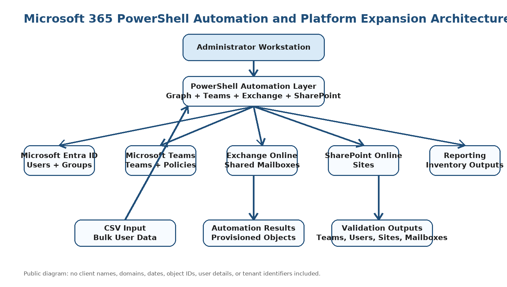

## Project Summary

| Area | Details |
|---|---|
| Project Type | Microsoft 365 PowerShell automation and platform expansion |
| Project | Microsoft 365 automation project |
| Client Type | Growing organization |
| Environment | Microsoft 365 cloud tenant |
| Primary Role | Microsoft 365 Engineer / Cloud Administrator |
| Project Focus | PowerShell automation, user provisioning, group management, Teams creation, mailbox creation, SharePoint site creation, and reporting |
| Public Version Note | Sensitive information, object identifiers, tenant identifiers, names, domains, and email addresses are redacted |

## Business Requirement

The organization required a scalable and repeatable way to expand Microsoft 365 services as new users, groups, Teams, shared mailboxes, and SharePoint sites were needed. Manual configuration through admin portals was not efficient enough for repeatable onboarding, collaboration setup, and administrative reporting.

The environment needed to support:

- PowerShell-based Microsoft 365 user creation
- Bulk user provisioning from CSV input
- Microsoft 365 group creation
- Group membership assignment
- Microsoft Teams creation
- Teams meeting policy creation
- Shared mailbox creation
- SharePoint Online site creation
- Teams, mailbox, user, and SharePoint site reporting

## Technologies Used

- Microsoft Graph PowerShell
- Microsoft Teams PowerShell
- Exchange Online PowerShell
- SharePoint Online Management Shell
- Microsoft Entra ID
- Microsoft Teams
- Exchange Online
- SharePoint Online
- CSV-based input files
- PowerShell scripting

## Scope of Work

Completed work included:

- Created a Microsoft 365 user using PowerShell
- Imported CSV input for bulk user provisioning
- Created Microsoft 365 groups using PowerShell
- Added a user to a Microsoft 365 group using object references
- Created Microsoft Teams using Teams PowerShell
- Created a Teams meeting policy using PowerShell
- Created a shared mailbox using Exchange Online PowerShell
- Created a SharePoint Online site using SharePoint Online Management Shell
- Retrieved Teams inventory using PowerShell
- Retrieved mailbox inventory using PowerShell
- Retrieved Microsoft 365 users using Microsoft Graph PowerShell
- Retrieved SharePoint Online sites using PowerShell

## Implementation Evidence

The screenshots below use surgical redaction. The PowerShell command structure and administrative workflow remain visible while names, email addresses, domains, object IDs, group IDs, tenant URLs, SharePoint URLs, dates, timestamps, request IDs, mailbox details, and site details are blocked.

### 1. PowerShell User Creation

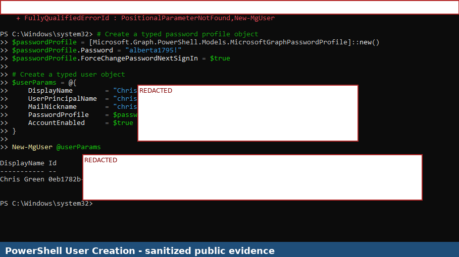

### 2. Bulk User Creation from CSV

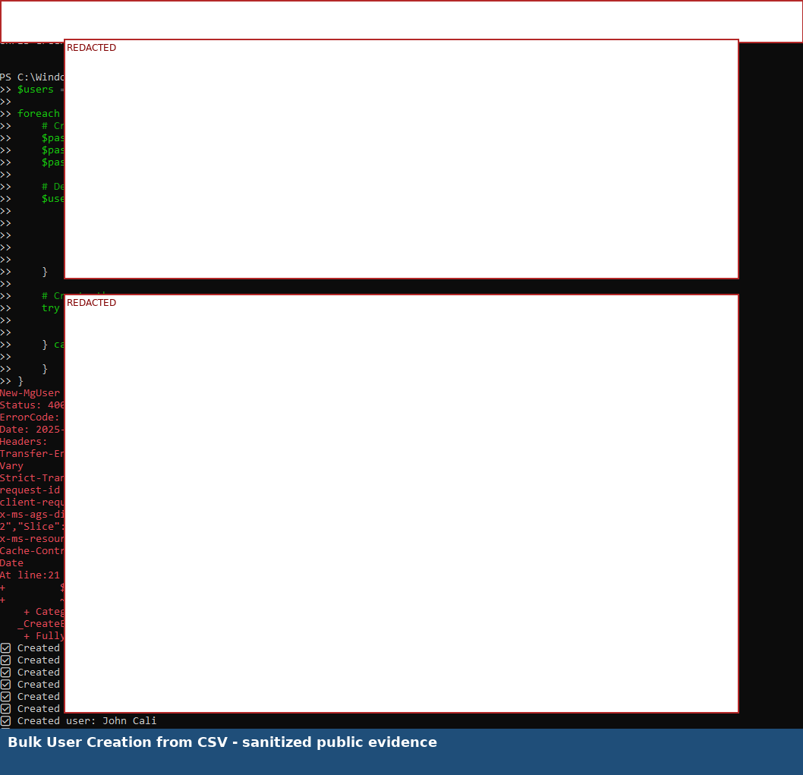

### 3. Groups Created with PowerShell

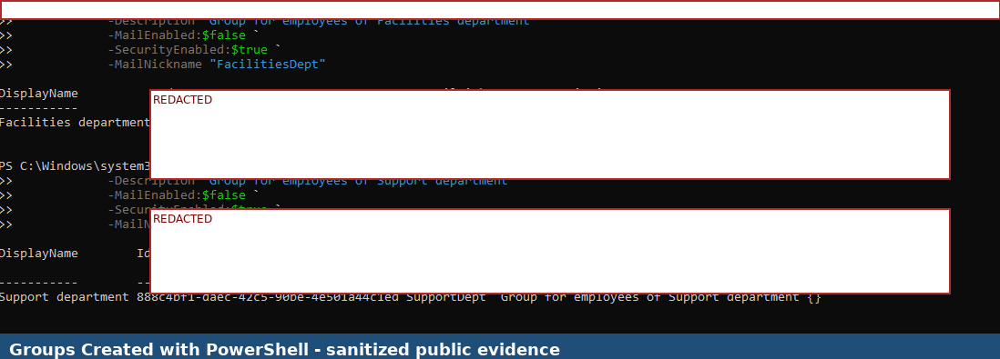

### 4. Add User to Group with PowerShell

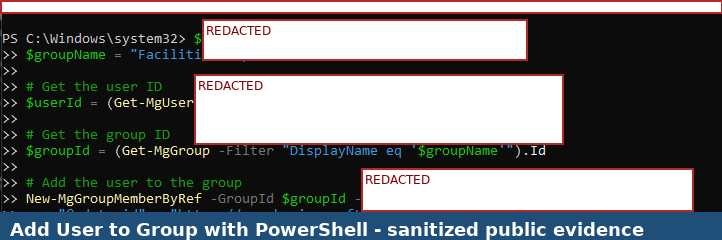

### 5. Teams Created with PowerShell

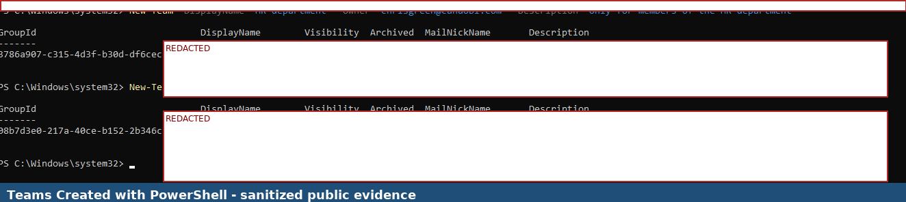

### 6. Teams Meeting Policy Created

### 7. Shared Mailbox Created

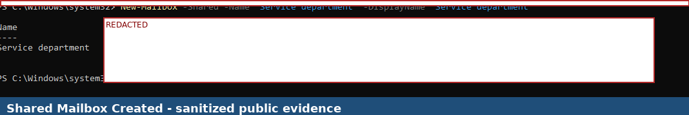

### 8. SharePoint Site Created

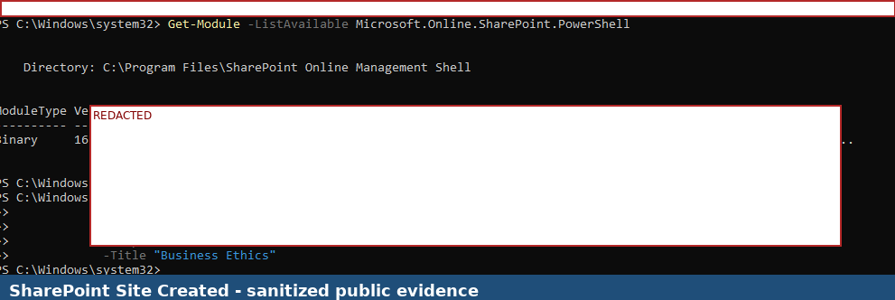

### 9. Teams Reporting with PowerShell

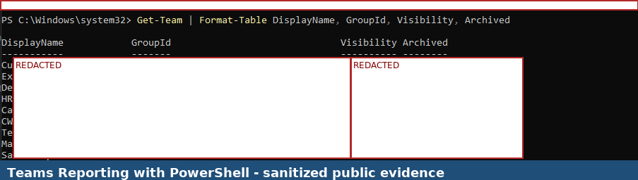

### 10. Mailbox Reporting with PowerShell

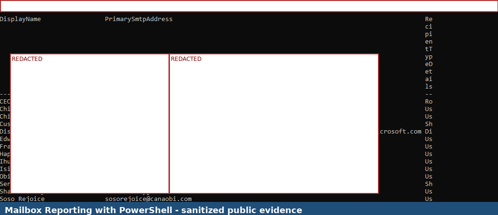

### 11. Microsoft 365 User Reporting with PowerShell

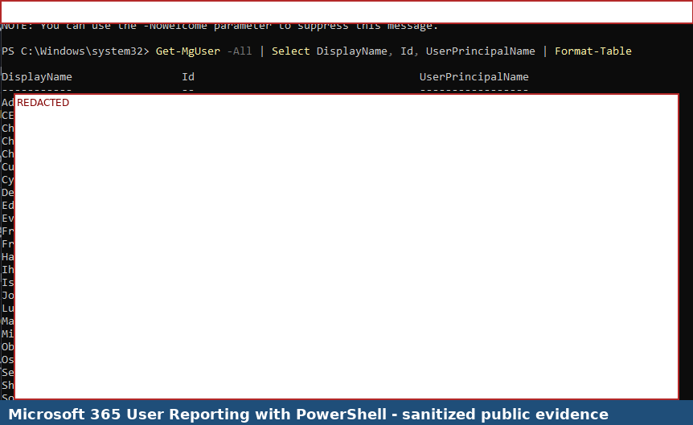

### 12. SharePoint Site Reporting with PowerShell

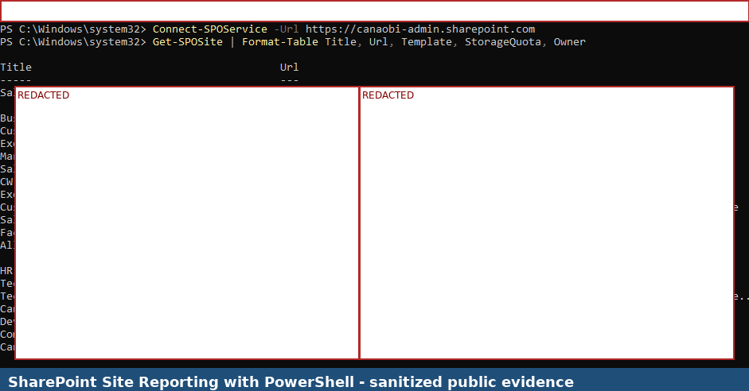

## Validation Results

| Validation Area | Expected Result | Actual Result |
|---|---|---|
| PowerShell user creation | User creation command completes and returns user details | Successful |
| CSV-based bulk user workflow | CSV data is imported and processed by the script | Validated with output |
| Group creation | Microsoft 365 groups are created and returned in command output | Successful |
| Group membership assignment | User is added to selected group using object references | Successful |
| Teams creation | Teams are created using PowerShell commands | Successful |
| Teams meeting policy creation | Teams meeting policy is created and retrievable | Successful |
| Shared mailbox creation | Shared mailbox is created in Exchange Online | Successful |
| SharePoint site creation | SharePoint site is created using SharePoint Online Management Shell | Successful |
| Teams reporting | Teams inventory is retrievable using PowerShell | Successful |
| Mailbox reporting | Mailbox list is retrievable using PowerShell | Successful |
| Microsoft 365 user reporting | User inventory is retrievable using Microsoft Graph PowerShell | Successful |
| SharePoint site reporting | SharePoint site inventory is retrievable using PowerShell | Successful |

## Key Skills Demonstrated

- Microsoft Graph PowerShell administration
- Microsoft Teams PowerShell administration
- Exchange Online PowerShell administration
- SharePoint Online Management Shell administration
- PowerShell-based user provisioning
- CSV-based bulk onboarding workflow
- Microsoft 365 group creation and membership assignment
- Microsoft Teams creation and policy management
- Shared mailbox creation
- SharePoint Online site creation
- PowerShell reporting for Teams, mailboxes, users, and SharePoint sites
- Public portfolio redaction and confidentiality handling

## Security and Confidentiality Notice

This public portfolio version was redacted before GitHub upload. The purpose is to demonstrate hands-on Microsoft 365 PowerShell automation while protecting confidential information.

The following information has been removed or blocked from the public version:

- Company names
- User display names and usernames
- Email addresses and domains
- Tenant names and tenant URLs
- Microsoft Graph object IDs, group IDs, and directory object IDs
- SharePoint admin URLs and site URLs
- Mailbox names, aliases, proxy addresses, and SMTP addresses
- CSV file names and local file paths where sensitive
- Error request IDs, diagnostic data, timestamps, and tokens
- Dates and times shown in command output

## Lessons Learned

- PowerShell improves repeatability for Microsoft 365 administration tasks.
- CSV-based workflows can support bulk onboarding when properly validated.
- Object IDs and group IDs are important in scripted Microsoft 365 administration.
- Microsoft Teams can be provisioned and governed using PowerShell.
- Exchange Online PowerShell supports mailbox creation and reporting workflows.
- SharePoint Online Management Shell supports site creation and site inventory review.
- PowerShell output must be carefully redacted before being used in a public portfolio.

## Project Outcome

The Microsoft 365 environment was expanded and validated using PowerShell automation. Users, groups, group memberships, Teams, Teams meeting policies, shared mailboxes, SharePoint sites, Teams inventory, mailbox inventory, Microsoft 365 users, and SharePoint sites were created or retrieved through PowerShell-based administration workflows.

The project demonstrates practical automation capability across Microsoft 365 identity, Teams, Exchange Online, and SharePoint Online workloads.

## Conclusion

This project demonstrates Microsoft 365 PowerShell automation experience across Microsoft Graph PowerShell, Microsoft Teams PowerShell, Exchange Online PowerShell, and SharePoint Online Management Shell. It supports career positioning for Microsoft 365 Engineer, Microsoft 365 Administrator, Cloud Engineer, Teams Engineer, and Modern Workplace Engineer roles.
