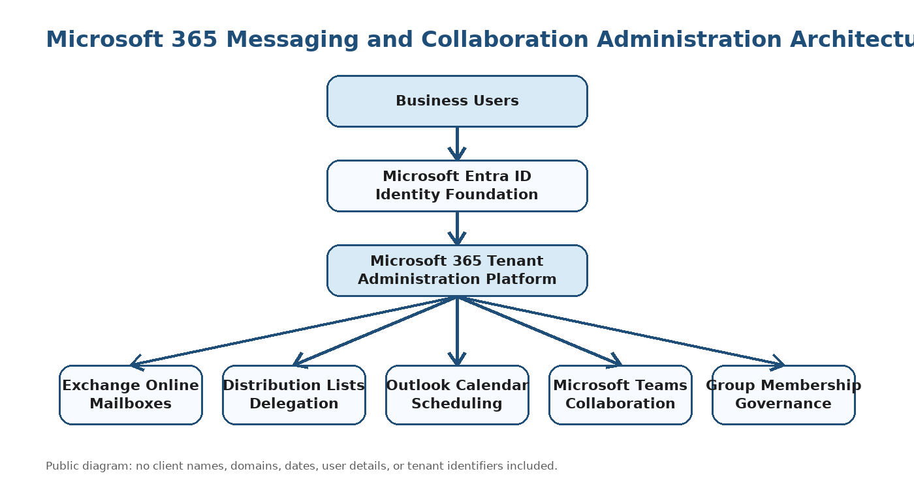
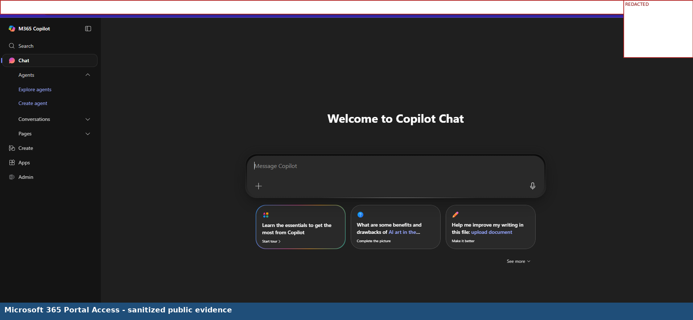
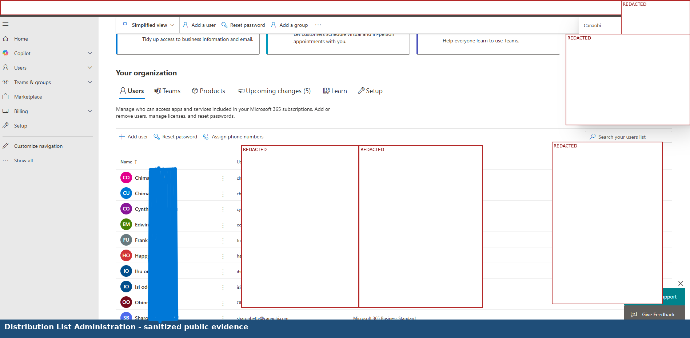
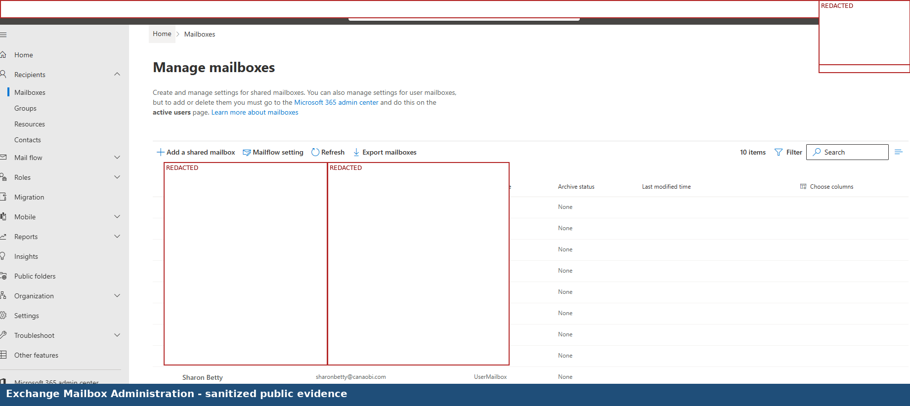
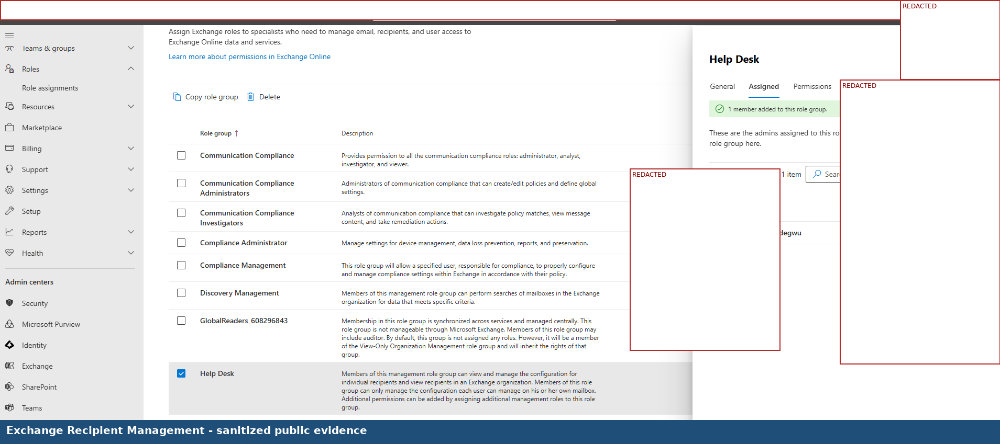
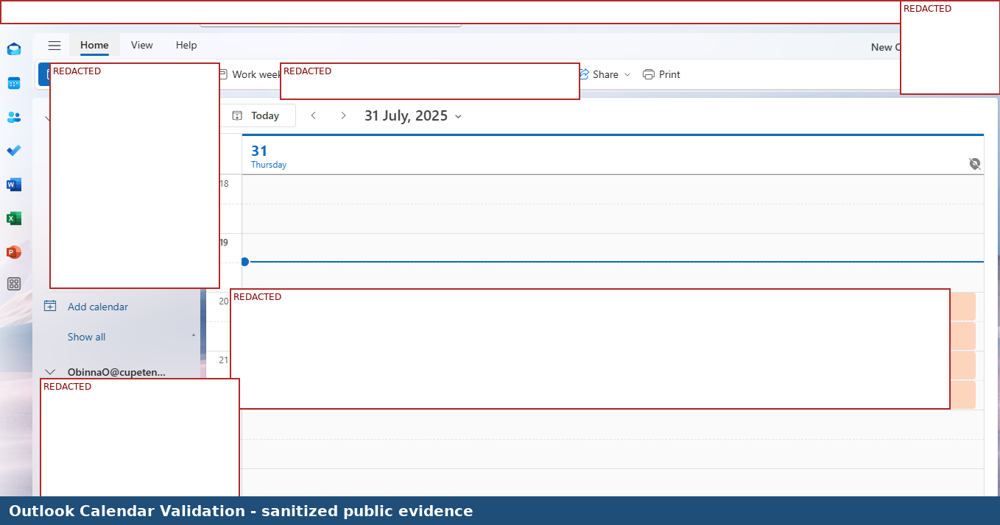
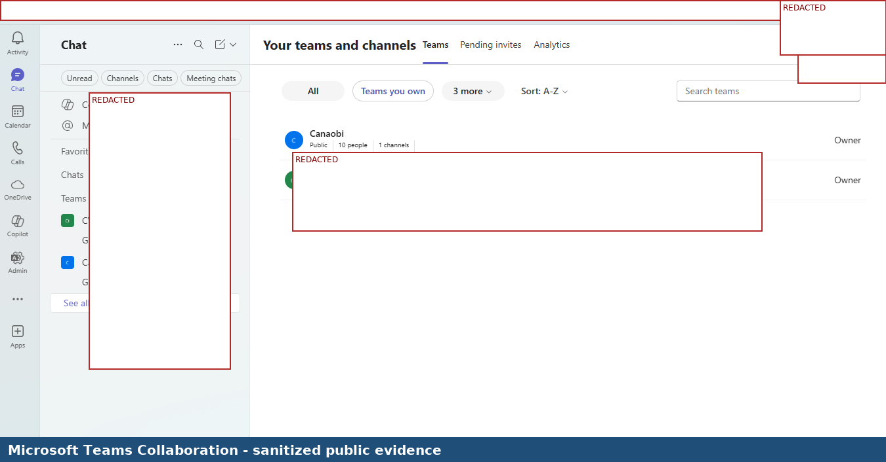
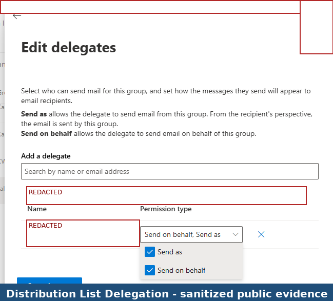
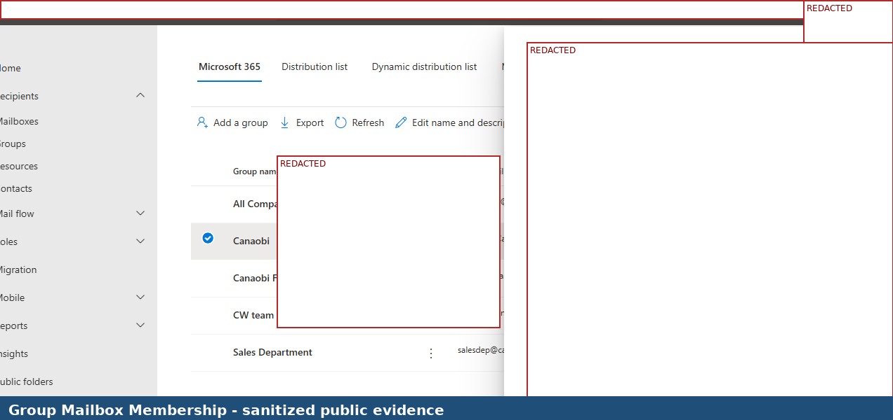

# Microsoft 365 Messaging, Distribution Lists and Collaboration Administration

## Project Overview

This project demonstrates Microsoft 365 messaging and collaboration administration within a Microsoft 365 cloud environment. The project focused on distribution list administration, Exchange Online mailbox review, recipient management, delegated permission review, Outlook Calendar validation, Microsoft Teams collaboration review, and group mailbox membership review.

This public GitHub version has been sanitized. Company names, user names, email addresses, domains, tenant names, tenant URLs, calendar dates, meeting details, mailbox details, Teams membership details, and other private information have been redacted.

## Architecture

## Project Summary

| Area | Details |
|---|---|
| Project Type | Microsoft 365 messaging and collaboration administration |
| Project Level | Level 1 foundational Microsoft 365 administration project |
| Client Type | Small business organization |
| Environment | Microsoft 365 cloud tenant |
| Primary Role | Microsoft 365 Cloud Engineer |
| Project Focus | Exchange Online, distribution lists, delegation, Outlook Calendar, Teams, and group membership validation |
| Public Version Note | Sensitive information, dates, tenant identifiers, names, and email addresses are redacted |

## Business Requirement

The organization required a centralized Microsoft 365 platform to manage messaging, group communication, mailbox administration, calendar scheduling, delegated access, and collaboration services.

The environment needed to support:

- Exchange Online mailbox administration
- Distribution list review and administration
- Group-based communication
- Delegated communication permissions
- Outlook Calendar scheduling validation
- Microsoft Teams collaboration review
- Group mailbox membership review
- Microsoft 365 administration visibility for messaging and collaboration workloads

## Technologies Used

- Microsoft 365 Portal
- Microsoft 365 Admin Center
- Exchange Admin Center
- Exchange Online
- Distribution Lists
- Delegated Permissions
- Outlook Calendar
- Microsoft Teams
- Microsoft Entra ID
- Group Mailbox Membership
- Microsoft 365 Messaging and Collaboration Services

## Scope of Work

Completed work included:

- Accessed the Microsoft 365 portal
- Reviewed Microsoft 365 distribution list administration
- Reviewed Exchange Admin Center mailbox visibility
- Reviewed Exchange recipient management visibility
- Validated Outlook Calendar meeting visibility
- Reviewed Microsoft Teams collaboration visibility
- Reviewed distribution list delegation configuration
- Reviewed group mailbox membership configuration
- Documented screenshots as delivery evidence
- Sanitized screenshots for public portfolio use

## Implementation Evidence

The screenshots below use surgical redaction. The Microsoft 365 product areas and task context remain visible, while names, emails, domains, tenant identifiers, dates, meeting details, mailbox details, and membership details are blocked.

### 1. Microsoft 365 Portal Access

### 2. Distribution List Administration

### 3. Exchange Mailbox Administration

### 4. Exchange Recipient Management

### 5. Outlook Calendar Validation

### 6. Microsoft Teams Collaboration

### 7. Distribution List Delegation

### 8. Group Mailbox Membership

## Validation Results

| Validation Area | Expected Result | Actual Result |
|---|---|---|
| Microsoft 365 portal access | Administrator can access Microsoft 365 cloud services | Successful |
| Distribution list review | Distribution list administration area is accessible | Successful |
| Exchange Admin Center access | Exchange administration area is accessible | Successful |
| Mailbox visibility | Mailboxes can be reviewed through Exchange Online administration | Successful |
| Recipient management visibility | Mail recipients and related configuration areas can be reviewed | Successful |
| Outlook Calendar access | Calendar and meeting visibility can be reviewed | Successful |
| Microsoft Teams visibility | Teams collaboration area can be reviewed | Successful |
| Distribution list delegation | Delegation configuration can be reviewed | Successful |
| Group mailbox membership | Group mailbox membership can be reviewed | Successful |

## Key Skills Demonstrated

- Microsoft 365 administration portal navigation
- Exchange Online mailbox administration
- Distribution list administration
- Exchange recipient management review
- Delegated permission review
- Group mailbox membership review
- Outlook Calendar validation
- Microsoft Teams collaboration review
- Microsoft 365 messaging and collaboration validation
- Public portfolio redaction and confidentiality handling

## Security and Confidentiality Notice

This public portfolio version was redacted before GitHub upload. The purpose is to demonstrate hands-on Microsoft 365 administration while protecting confidential information.

The following information has been removed or blocked from the public version:

- Company names
- Usernames and display names
- Email addresses and domains
- Tenant names and tenant URLs
- Calendar dates and times
- Meeting titles and meeting details
- Mailbox names and recipient details
- Distribution list details where sensitive
- Teams names and membership details
- Group mailbox membership details
- Admin identifiers and credential references

## Lessons Learned

- Distribution lists are important for group-based communication.
- Exchange Online provides centralized mailbox and recipient administration.
- Delegated permissions must be reviewed carefully because they affect group-based communication.
- Outlook Calendar visibility supports meeting coordination and operational scheduling.
- Microsoft Teams supports collaboration and membership-based access visibility.
- Group membership review is important for communication governance.
- Screenshots used in a public portfolio must be redacted enough to protect identity, while still showing useful proof of technical work.

## Project Outcome

The Microsoft 365 messaging and collaboration environment was successfully reviewed and validated. Distribution list administration, Exchange Online mailbox visibility, recipient management, delegated communication settings, Outlook Calendar functionality, Microsoft Teams visibility, and group mailbox membership were reviewed as part of the project evidence.

The project demonstrates practical Microsoft 365 administration capability across communication and collaboration workloads commonly used in business environments.

## Conclusion

This project demonstrates foundational Microsoft 365 administration experience across Exchange Online, distribution lists, delegated permissions, Outlook Calendar, Microsoft Teams, and group mailbox membership. It supports career positioning for Microsoft 365 Cloud Engineer, Exchange Online Administrator, Modern Workplace Engineer, and Collaboration Engineer roles.
