# Microsoft 365 Tenant Deployment and User Onboarding

## Project Overview

This project demonstrates the setup and validation of a Microsoft 365 cloud environment for a small business scenario. The project focused on Microsoft 365 portal access, user creation, license assignment, Exchange Online mailbox validation, Microsoft Teams enablement, SharePoint Online document storage, Outlook access testing, and Microsoft Teams meeting validation.

This public GitHub version has been sanitized. Company names, user names, email addresses, domains, tenant names, tenant URLs, dates, mailbox details, document names, message details, meeting details, and participant details have been redacted.

## Architecture

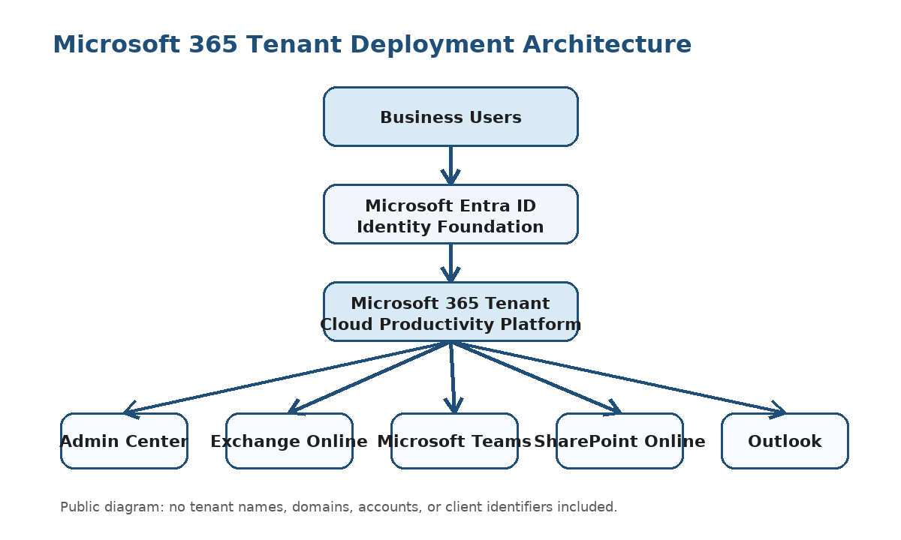

## Project Summary

| Area | Details |
|---|---|
| Project Type | Microsoft 365 tenant setup and user onboarding |
| Project Level | Level 1 foundational Microsoft 365 administration project |
| Client Type | Small business organization |
| Environment | Microsoft 365 cloud tenant |
| Primary Role | Microsoft 365 Cloud Engineer |
| Project Focus | Tenant setup, user onboarding, licensing, Exchange Online, Teams, SharePoint, Outlook, and meeting validation |
| Public Version Note | Sensitive information, dates, tenant identifiers, names, and email addresses are redacted |

## Business Requirement

The organization required a centralized Microsoft 365 environment that would allow users to communicate through email, collaborate in Microsoft Teams, store documents in SharePoint Online, and participate in online meetings.

The environment needed to support:

- User account creation and onboarding
- Microsoft 365 license assignment
- Exchange Online mailbox availability
- Microsoft Teams communication and meeting access
- SharePoint Online document storage
- Outlook desktop and web mailbox access
- Microsoft Teams meeting creation and file sharing
- Administrator validation of core Microsoft 365 services

## Technologies Used

- Microsoft 365 Admin Center
- Microsoft Entra ID
- Microsoft Teams Admin Center
- Exchange Admin Center
- Exchange Online
- SharePoint Admin Center
- SharePoint Online
- Outlook Desktop Client
- Outlook on the Web
- Microsoft Teams Meetings
- Microsoft 365 Licensing
- Microsoft 365 User Management

## Scope of Work

Completed work included:

- Accessed the Microsoft 365 portal
- Opened and reviewed the Microsoft 365 Admin Center
- Created Microsoft 365 user accounts
- Assigned Microsoft 365 licenses to users
- Reviewed active users and groups
- Validated Microsoft Teams service availability
- Reviewed Exchange Online mailboxes
- Reviewed Microsoft Entra ID as the identity management layer
- Accessed SharePoint Online Admin Center
- Uploaded a document to a SharePoint document library
- Tested Outlook desktop email access
- Tested Outlook web email access
- Created and validated a Microsoft Teams meeting
- Validated file sharing during a Microsoft Teams meeting

## Implementation Evidence

The screenshots below use surgical redaction. Microsoft 365 product areas and task context remain visible, while names, emails, domains, tenant identifiers, dates, document names, message details, mailbox details, participant details, and meeting details are blocked.

### 1. Microsoft 365 Portal Access

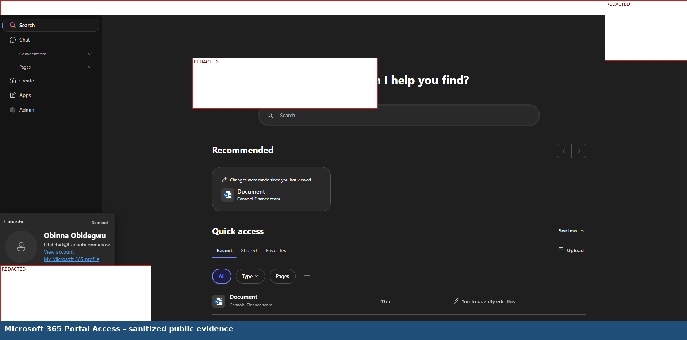

### 2. Microsoft 365 Admin Center

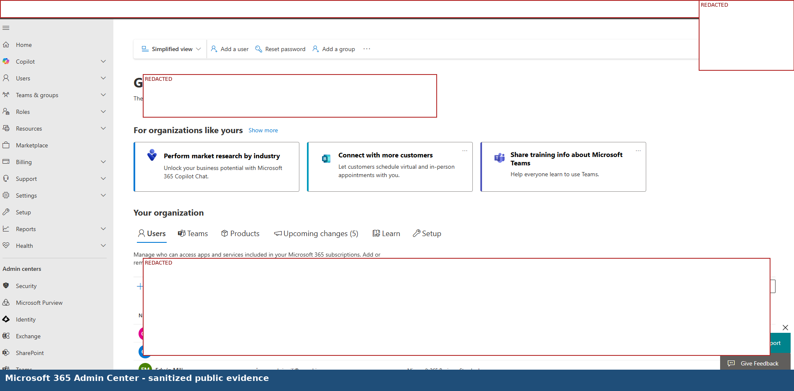

### 3. Active Users and Groups

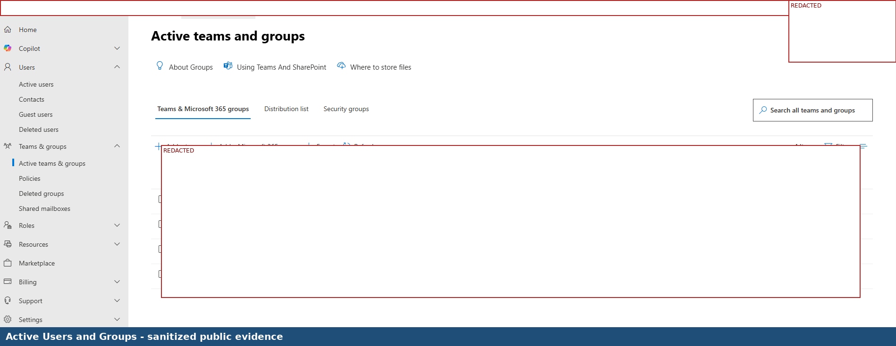

### 4. User Properties and License Assignment

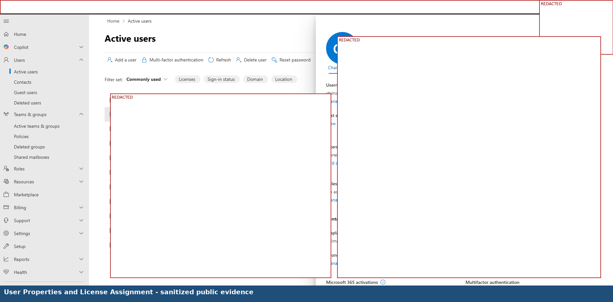

### 5. Microsoft Teams Admin Center

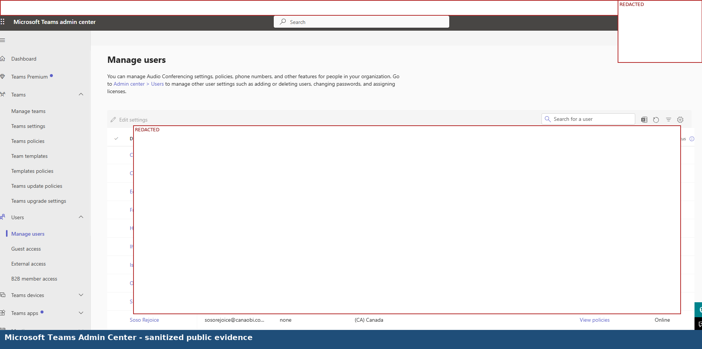

### 6. Exchange Admin Center

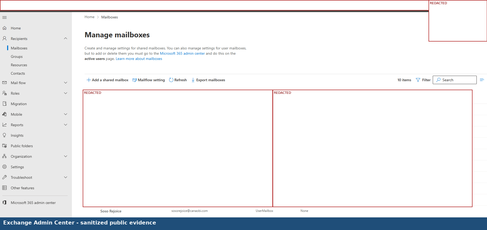

### 7. Microsoft Entra ID Admin Center

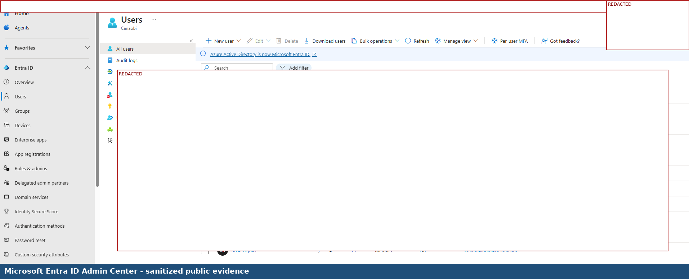

### 8. SharePoint Admin Center

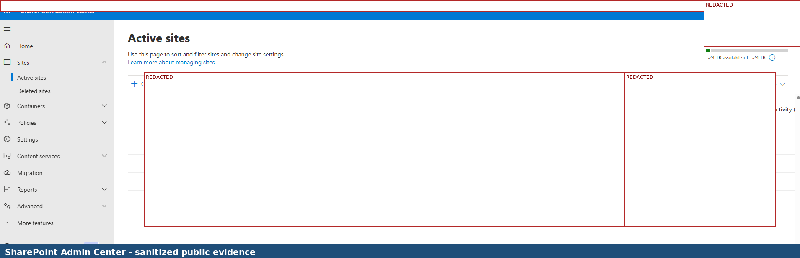

### 9. SharePoint Document Upload

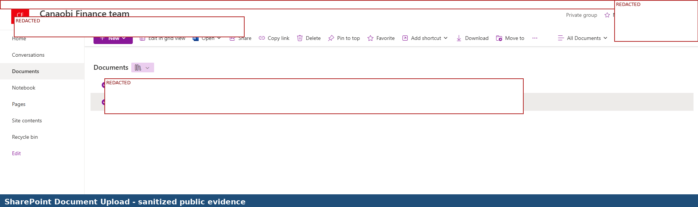

### 10. Outlook Desktop Inbox

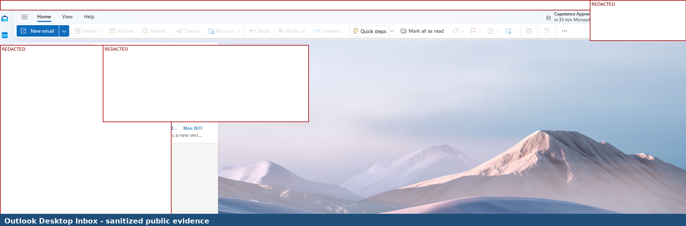

### 11. Outlook on the Web Inbox

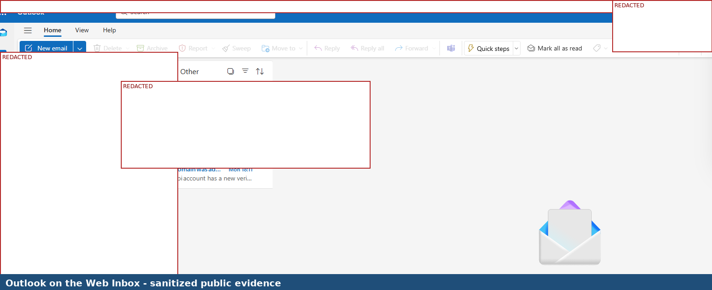

### 12. Microsoft Teams Meeting Validation

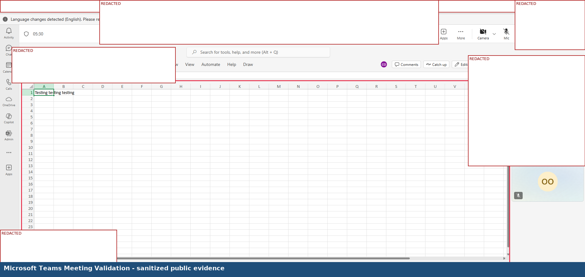

## Validation Results

| Validation Area | Expected Result | Actual Result |
|---|---|---|
| Microsoft 365 portal access | Administrator can access Microsoft 365 cloud services | Successful |
| Microsoft 365 Admin Center access | Administrator can access tenant administration tools | Successful |
| User account creation | New user account can be created in Microsoft 365 | Successful |
| License assignment | User receives Microsoft 365 service access after licensing | Successful |
| Active users review | Created users appear in the active users area | Successful |
| Microsoft Teams availability | Teams is available for communication and meetings | Successful |
| Exchange Online mailbox review | User mailboxes are visible in Exchange Admin Center | Successful |
| Microsoft Entra ID access | Identity administration area is accessible | Successful |
| SharePoint Online access | SharePoint Admin Center is accessible | Successful |
| SharePoint document upload | Document can be uploaded to a SharePoint library | Successful |
| Outlook desktop access | Mailbox can be accessed through Outlook desktop | Successful |
| Outlook web access | Mailbox can be accessed through Outlook on the Web | Successful |
| Teams meeting creation | Microsoft Teams meeting can be created | Successful |
| Teams file sharing | File can be shared during a Microsoft Teams meeting | Successful |

## Key Skills Demonstrated

- Microsoft 365 tenant administration
- User account creation and onboarding
- Microsoft 365 license assignment
- Exchange Online mailbox validation
- Outlook desktop and web access testing
- Microsoft Teams service validation
- Microsoft Teams meeting testing
- SharePoint Online document storage validation
- Microsoft Entra ID administration awareness
- End-user productivity service validation
- Public portfolio redaction and confidentiality handling

## Security and Confidentiality Notice

This public portfolio version was redacted before GitHub upload. The purpose is to demonstrate hands-on Microsoft 365 administration while protecting confidential information.

The following information has been removed or blocked from the public version:

- Company names
- Usernames and display names
- Email addresses and domains
- Tenant names and tenant URLs
- Dates and times
- Mailbox names and message details
- SharePoint site names and document names
- Teams meeting titles, participant details, and shared file names
- Admin identifiers and account/profile information

## Lessons Learned

- Microsoft Entra ID is the identity foundation for Microsoft 365 access.
- Microsoft 365 licenses must be assigned before users can access Exchange Online, Teams, SharePoint, and Outlook.
- Exchange Online mailbox availability should be reviewed after user creation and licensing.
- Microsoft Teams and SharePoint Online work together to support collaboration, meetings, and document sharing.
- Outlook desktop and Outlook on the Web should both be tested to confirm flexible mailbox access.
- A successful Microsoft 365 deployment should be validated from both the administrator side and the end-user side.
- Screenshots used in a public portfolio must be redacted enough to protect identity while still showing useful proof of technical work.

## Project Outcome

The Microsoft 365 environment was successfully configured and validated for core productivity services. User onboarding was completed through account creation and license assignment. Exchange Online mailbox availability was reviewed, Outlook desktop and web access were validated, Microsoft Teams availability and meeting functionality were tested, and SharePoint Online document upload was confirmed.

The project delivered a working Microsoft 365 foundation that supports business email, cloud identity, collaboration, document storage, online meetings, and user productivity.

## Conclusion

This project demonstrates foundational Microsoft 365 administration experience across the core services needed by a small business environment. It shows the ability to configure users, assign licenses, validate Microsoft 365 workloads, support collaboration, and confirm that business users can access Microsoft 365 tools required for daily operations.
