# Microsoft Teams Platform Expansion, Governance and Communications Project

## Project Overview

This project demonstrates the expansion and governance of a Microsoft Teams environment for organizational collaboration and communications. The project focused on departmental Team administration, private channels, Teams policies, messaging policies, meeting settings, caller ID policies, Teams Rooms / room booking, audio conferencing, Teams Events, and calling policy review.

This public GitHub version has been sanitized. Company names, admin usernames, user names, email addresses, domains, tenant names, room details, policy identifiers where sensitive, dates, phone numbers, and credential-related details have been redacted.

## Architecture

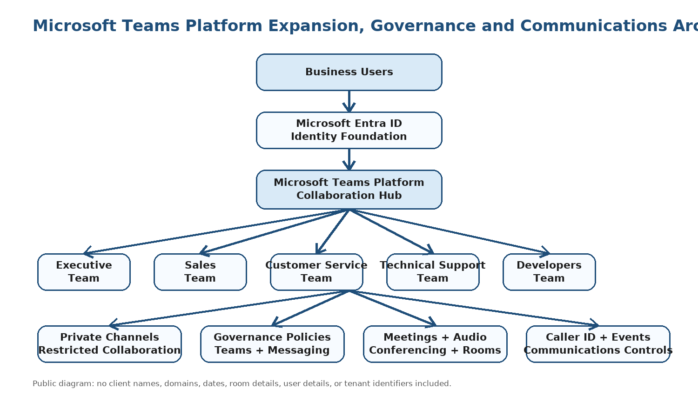

## Project Summary

| Area | Details |
|---|---|
| Project Type | Microsoft Teams platform expansion and governance |
| Project Level | Level 2 Microsoft Teams administration project |
| Client Type | Growing organization |
| Environment | Microsoft 365 cloud tenant |
| Primary Role | Microsoft 365 Cloud Engineer / Microsoft Teams Engineer |
| Project Focus | Teams structure, private channels, Teams policies, messaging policies, meeting governance, caller ID, Teams Rooms, audio conferencing, and Teams Events |
| Public Version Note | Sensitive information, dates, tenant identifiers, names, policy identifiers, room details, and email addresses are redacted |

## Business Requirement

The organization required an expanded Microsoft Teams platform to support structured communication across multiple departments while maintaining governance and administrative control of collaboration services.

The environment needed to support:

- Department-based Teams workspaces
- Executive collaboration spaces
- Private channels for restricted business discussions
- Teams policies for business groups
- Messaging controls and governance
- Meeting settings and conferencing controls
- Caller ID policy management
- Teams Rooms and room booking configuration
- Audio conferencing policy review
- Teams Events policy review

## Technologies Used

- Microsoft Teams
- Microsoft Teams Admin Center
- Microsoft Entra ID
- Microsoft 365 Admin Center
- Teams Policies
- Messaging Policies
- Meeting Settings
- Caller ID Policies
- Teams Rooms / Room Booking
- Audio Conferencing
- Teams Events
- Microsoft 365 Licensing

## Scope of Work

Completed work included:

- Created and reviewed departmental Teams
- Reviewed Executive Team workspace configuration
- Reviewed private channel configuration
- Reviewed Teams policies for business groups
- Reviewed messaging policy details
- Reviewed Teams meeting settings
- Reviewed Caller ID policy settings
- Reviewed room booking options for conferencing rooms
- Reviewed audio conferencing policy configuration
- Reviewed Teams Events policy configuration
- Reviewed calling policy configuration
- Documented screenshots as delivery evidence
- Sanitized screenshots for public portfolio use

## Implementation Evidence

The screenshots below use surgical redaction. Microsoft Teams product areas and task context remain visible while names, domains, tenant details, policy-specific identifiers, room details, dates, phone numbers, and credential-related details are blocked.

### 1. Sales Department Team Administration

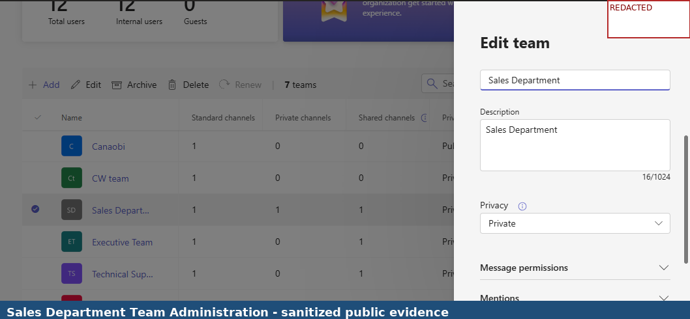

### 2. Executive Team Administration

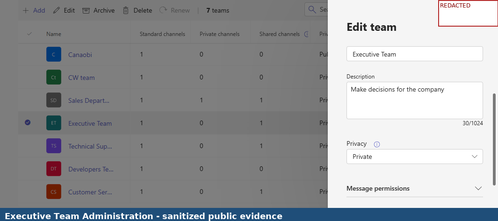

### 3. Technical Support Team Administration

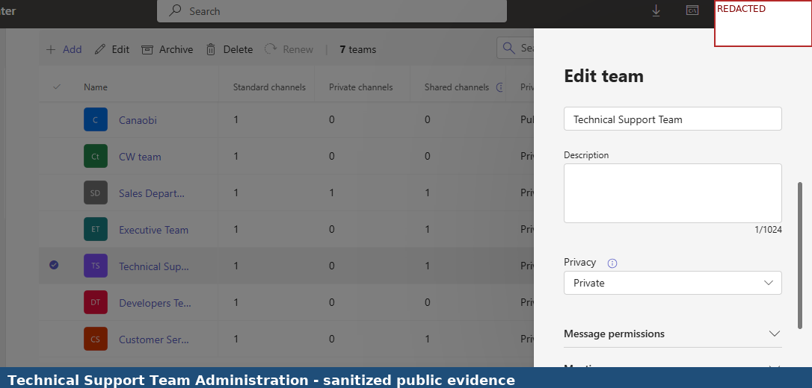

### 4. Customer Service Team Administration

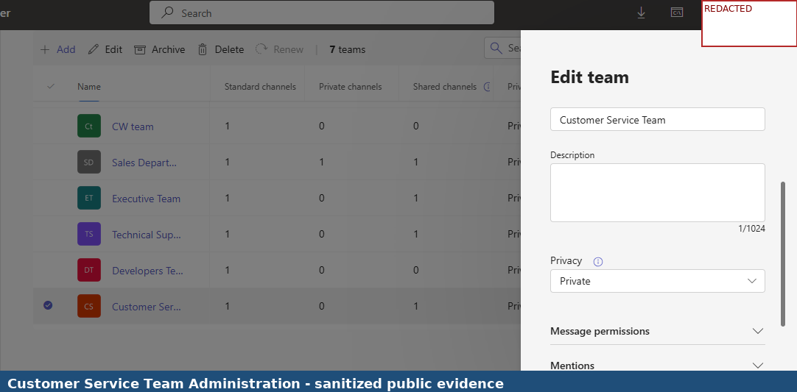

### 5. Developers Team Administration

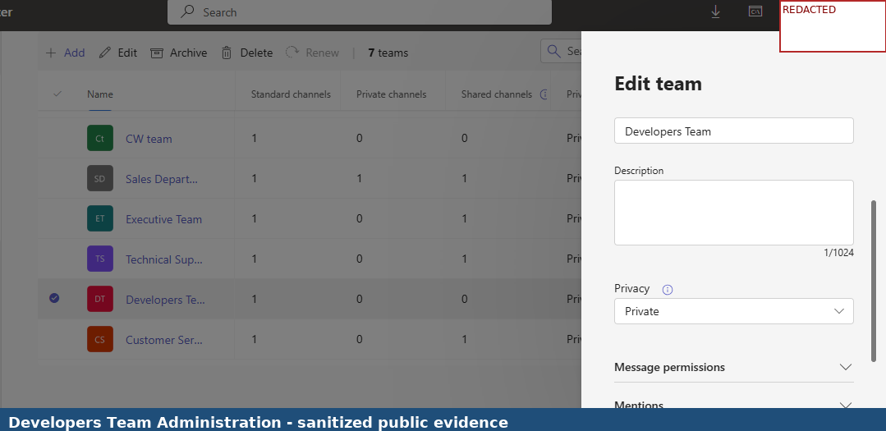

### 6. Executive Team Page

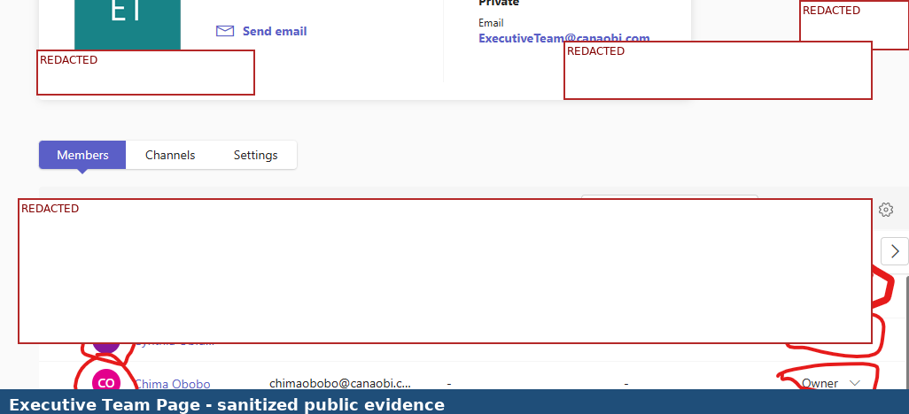

### 7. Private Channel Listing

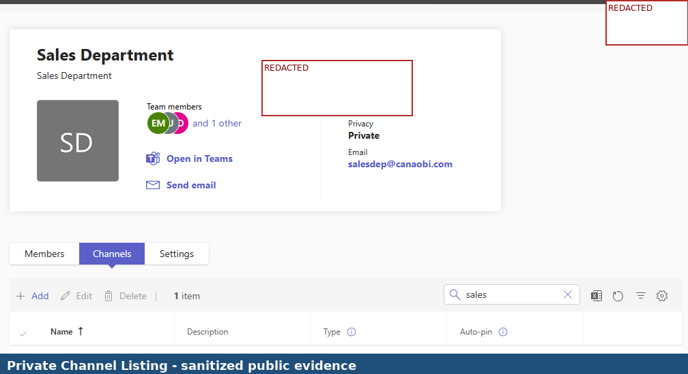

### 8. Executive Teams Policy

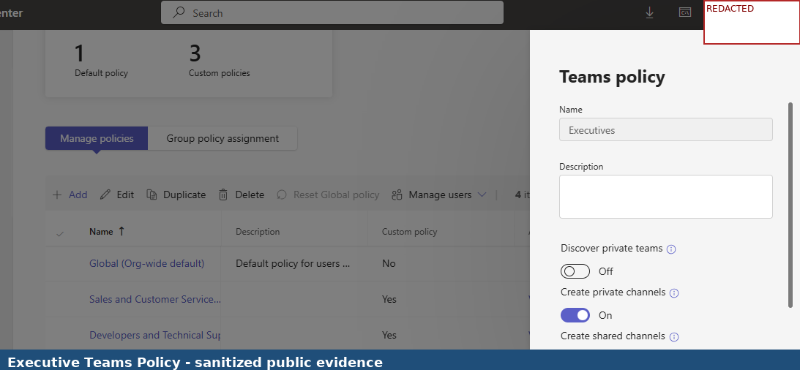

### 9. Sales and Customer Service Teams Policy

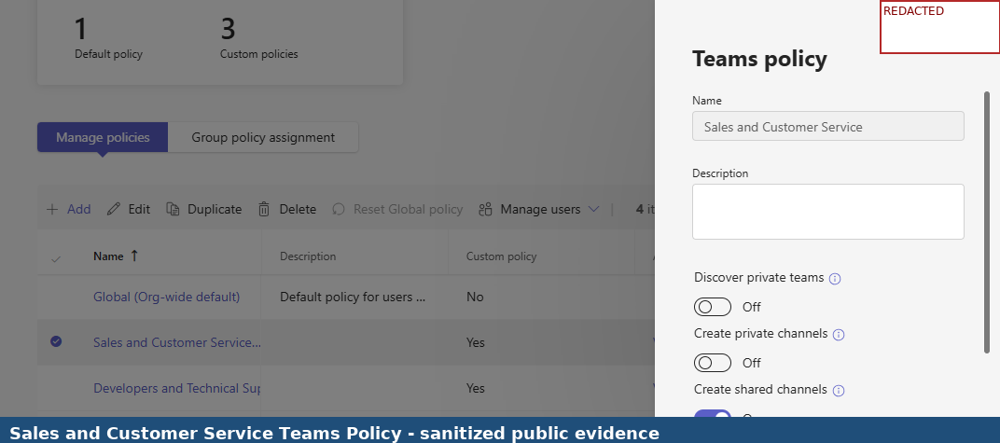

### 10. Sales and Customer Service Messaging Policy

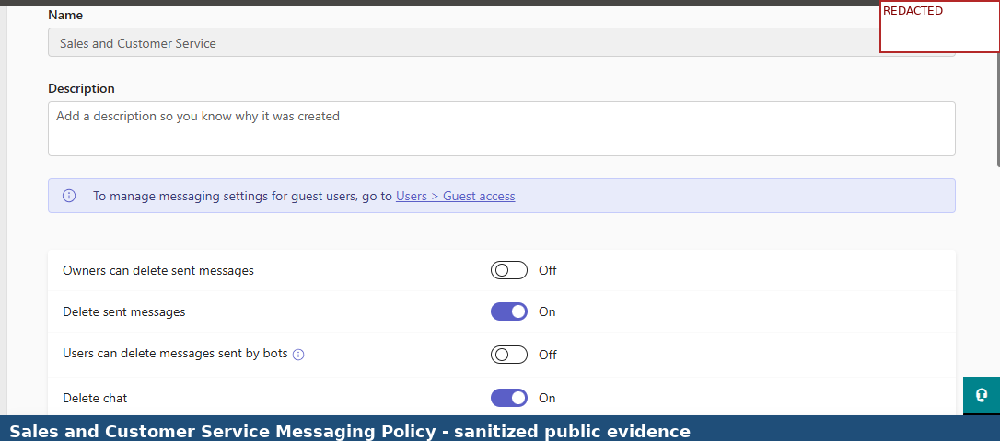

### 11. Executive Messaging Policy

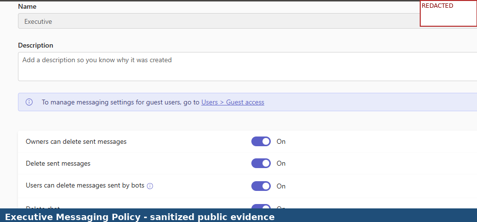

### 12. Teams Meeting Settings

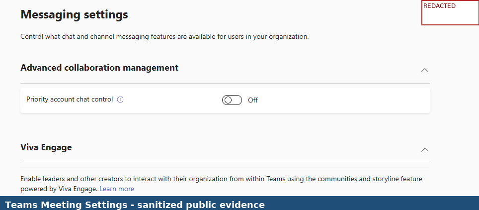

### 13. Executive Caller ID Policy

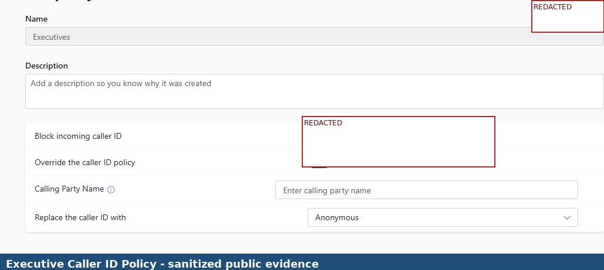

### 14. Room Booking Options

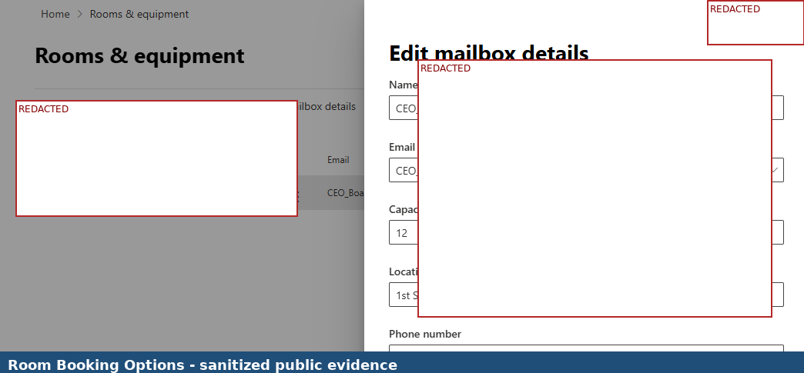

### 15. Audio Conferencing Policy

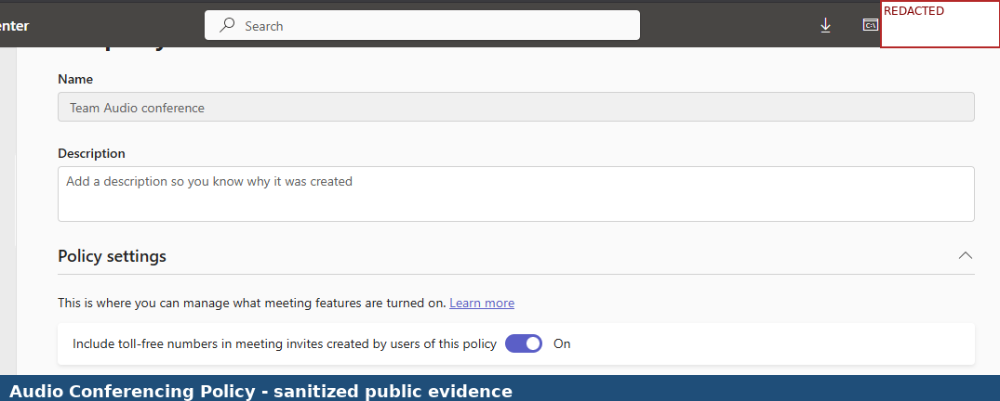

### 16. Teams Events Policy

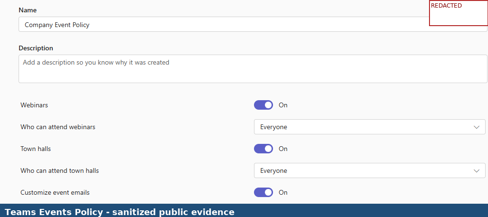

### 17. Executive Calling Policy

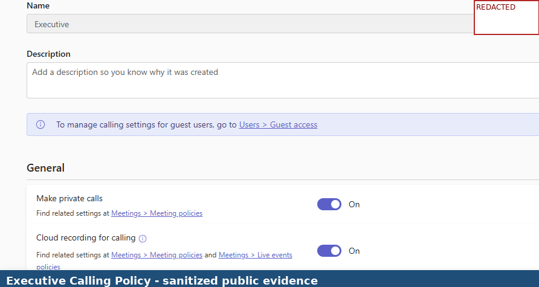

## Validation Results

| Validation Area | Expected Result | Actual Result |
|---|---|---|
| Departmental Team creation | Departmental Teams should be visible and administrable | Successful |
| Executive collaboration workspace | Executive Team workspace should be available | Successful |
| Private channel listing | Private channels should be visible for controlled collaboration | Successful |
| Teams policy review | Teams policies should be accessible and configured | Successful |
| Messaging policy review | Messaging policy controls should be visible and manageable | Successful |
| Meeting settings review | Teams meeting settings should be accessible | Successful |
| Caller ID policy review | Caller ID policies should be available for communication governance | Successful |
| Teams Rooms review | Room booking configuration should be available | Successful |
| Audio conferencing review | Audio conferencing policy should be available | Successful |
| Teams Events policy review | Teams Events controls should be available | Successful |

## Key Skills Demonstrated

- Microsoft Teams administration and governance
- Department-based Teams architecture
- Private channel administration
- Teams policy review
- Messaging policy governance
- Teams meeting governance
- Caller ID policy administration
- Teams Rooms and room booking review
- Audio conferencing administration
- Teams Events policy review
- Microsoft 365 communications documentation
- Public portfolio redaction and confidentiality handling

## Security and Confidentiality Notice

This public portfolio version was redacted before GitHub upload. The purpose is to demonstrate hands-on Microsoft Teams administration and governance while protecting confidential information.

The following information has been removed or blocked from the public version:

- Company names
- Admin usernames and credential-related references
- Usernames and display names
- Email addresses and domains
- Tenant names and tenant URLs
- Department or team identifiers where sensitive
- Private channel names where sensitive
- Room names, room mailbox details, addresses, and location details
- Policy names where they include internal identifiers
- Dates, times, phone numbers, and conferencing details
- Authentication or password-related details

## Lessons Learned

- Microsoft Teams governance becomes more important as organizations expand collaboration usage.
- Department-based Teams help structure collaboration around business functions.
- Private channels are useful for restricted collaboration scenarios.
- Messaging policies and Teams policies support consistent communication governance.
- Meeting settings and audio conferencing require central review to maintain predictable meeting experiences.
- Caller ID policies help support communication control for selected groups.
- Teams Rooms and room booking configuration connect cloud collaboration to physical meeting spaces.
- Public portfolio screenshots must protect organizations while still showing useful technical evidence.

## Project Outcome

The Microsoft Teams platform was successfully expanded and governed to support multiple business functions. Departmental Teams, private collaboration channels, Teams policies, messaging policies, meeting controls, caller ID policies, Teams Rooms resources, audio conferencing, and Teams Events capabilities were reviewed and administered.

The project demonstrates practical Microsoft Teams administration experience across communications governance, collaboration architecture, conferencing services, and Teams platform management.

## Conclusion

This project demonstrates Level 2 Microsoft Teams administration experience across Teams structure, private channels, Teams policies, messaging governance, meeting settings, caller ID policies, Teams Rooms, audio conferencing, and Teams Events. It supports career positioning for Microsoft 365 Cloud Engineer, Microsoft Teams Engineer, Modern Workplace Engineer, and Unified Communications Engineer roles.
